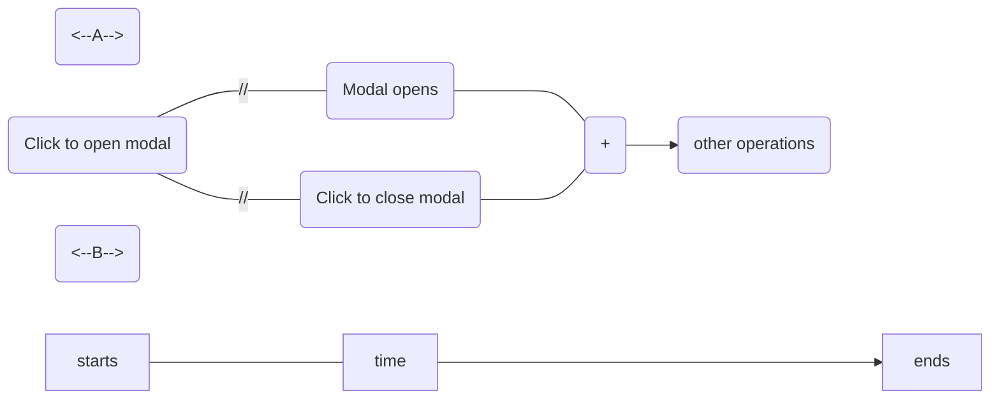

# Acceptance tests

**Parent:** Oppia Foundation — Project Ideas
**Source:** https://github.com/oppia/oppia/wiki/Acceptance-Tests
**Scraped:** 2026-02-22T23:28:47.620284

---

# Introduction

Acceptance tests are end-to-end tests that test the complete functionality of the application, and this will help users to catch bugs and regressions before they are released ensuring that the code does what it is supposed to do.

This guide will help you to get started on how to write `e2e acceptance test` for a particular user-type.


## Files and Directory Structure

```
oppia/core/tests/
 └── puppeteer-acceptance-tests
    ├── data
    │  └── blog-post-thumbnail.svg
    │  └── ...
    ├── functions
    │  └── is-element-clickable.ts
    ├── specs
    │  ├── blog-admin
    │  │    ├── assign-role-to-users-and-change-tag-properties.spec.ts
    │  │    └── ...
    │  ├── curriculum-admin
    │  │    ├── create-publish-unpublish-and-delete-topic-and-skill.spec.ts
    │  │    ├── create-edit-and-delete-classroom.spec.ts
    │  │    └── ...
    │  ├── topic-manager
    │  │    ├── create-and-delete-subtopic-and-story.spec.ts
    │  │    ├── browse-topics-on-topics-and-skills-dashboard.spec.ts
    │  │    └── ...
    │  ├── moderator
    │  │    ├── view-recent-commits-and-feedback-messages.spec.ts
    │  │    └── ...
    │  ├── site-admin
    │  │    ├── edit-user-roles.spec.ts
    │  │    └── ...
    │  ├── contributor-dashboard-admin
    │  │    ├── manage-translators-and-reviewers.spec.ts
    │  │    └── ...
    │  ├── release-coordinator
    │  │    ├── run-a-beam-job-and-copy-the-output.spec.ts
    │  │    └── ...
    │  ├── voiceover-admin
    │  │    ├── add-voiceover-artist-to-an-exploration.spec.ts
    │  ├── logged-out-user
    │  │    ├── click-all-buttons-on-contact-us-page.spec.ts
    │  │    ├── click-all-buttons-on-creator-guidelines-page.spec.ts
    │  │    └── ...
    │  ├── logged-in-user
    │  │    ├── create-and-delete-account.spec.ts
    │  │    ├── access-dashboards-and-other-pages-from-profile-menu.spec.ts
    │  │    └── ...
    │  ├── translation-admin
    │  │    ├── add-and-remove-translation-rights.spec.ts
    │  ├── practice-question-admin
    │  │    ├── add-and-remove-contribution-rights.spec.ts
    ├── utilities
    │  ├── common
    │  │    ├── puppeteer-utils.ts
    │  │    ├── show-message.ts
    │  │    ├── test-constants.ts
    │  │    ├── console-report.ts
    │  │    ├── user-factory.ts
    │  ├── user
    │  │    ├── blog-admin.ts
    │  │    ├── blog-post-editor.ts
    │  │    ├── curriculum-admin.ts
    │  │    ├── topic-manager.ts
    │  │    ├── moderator.ts
    │  │    ├── site-admin.ts
    │  │    ├── contributor-dashboard-admin.ts
    │  │    ├── release-coordinator-admin.ts
    │  │    ├── email-dashboard-admin.ts
    │  │    ├── voiceover-admin.ts
    │  │    ├── logged-in-user.ts
    │  │    ├── logged-out-user.ts
    │  │    ├── question-admin.ts
    │  │    ├── super-admin.ts
    │  │    ├── translation-admin.ts
```

The directory structure is as follows:
1) The `specs` directory contains all the top-level test files. Each test file is named as `*.spec.ts` and contains the test for a particular user type. For example, the `blog-admin` directory contains available tests for the `Blog Admin` user.

2) The `utilities` directory contains all the utility files and helper functions, which you would require to write new acceptance tests. This directory can also be used to append more utility functions as needed by the user.
Files included inside this directory are:
  - `common/puppeteer-utils.ts` -> This file contains the base _*BaseUser*_ class which provides the most common and useful methods such as _*openBrowser*_, _*goto*_, _*clickOn*_, _*openExternalPdfLink*_ etc. This class also serves as a foundation for defining other user-oriented subclasses, facilitating various testing scenarios.
  - `common/user-factory.ts` -> This file contains methods for creating a certain user. The file has different methods for creating different types of users.
  - `common/test-constants.ts` -> This file contains defined constants such as _*URLs, roles, etc.*_ which are used in the tests.
  - `common/console-report.ts` -> This file contains methods for listening the console errors during a test.
  - `common/show-message.ts` -> This file contains methods for displaying messages during the tests.

3) The `user` directory holds the utility files for different user types. Each user utility class is built upon the base `BaseUser` class containing the original methods along with the ones related to that user type. For example, `blog-post-editor.ts` contains base functions as well as additional functions just related to the `Blog Post Editor` user. 
4) The `data` directory contains all the images and other data files used in the tests.

## How to run the acceptance tests
From the root directory of oppia, run the following command:
```  
python -m scripts.run_acceptance_tests --suite={{suiteName}}  
``` 

For example, to run the `check-blog-editor-unable-to-publish-duplicate-blog-post.spec.ts` test, run the following command:
```
python -m scripts.run_acceptance_tests --suite="blog-editor/check-blog-editor-unable-to-publish-duplicate-blog-post"
```

> **TIP:** To reduce the development cycle for the tests, try using `--skip-build` to skip the build in the local environment as this can reduce the run-time of tests.

**Note: Typically, these tests take anywhere between 2 to 5-6 minutes (excluding the time taken for setting up the server) for any suite to run, both in headless and non-headless modes, assuming the machine has sufficient resources. The duration depends on the tests, and some tests can run longer due to a more extensive setup (if there is a longer setup, it would be mentioned in the timeout in the test block). However, tests with longer setups can go up to 8-10 minutes (currently, we have some such tests). Usually, the total runtime of tests would be around 3-4 minutes in most cases. In any case, if the run-time appears unreasonably long to you on you machine, feel free to raise an issue on our [issue tracker](https://github.com/oppia/oppia/issues).**

## How to write new tests for a specific user

1) Create a new directory for the specific user if it doesn't already exist inside the `specs` directory. For example, the `Topic Manager` user can have a directory named `topic-manager`, and within the user directory, each test file is named as `*.spec.ts`. 
> Note: Naming convention for directories/files is kebab case, where each word is separated by a (-).

2) Within the user directory, create a new file for each test. For example, `create-and-delete-subtopic-and-story.spec.ts` and `browse-topics-on-topics-and-skills-dashboard.spec.ts` for the `Topic Manager` user. These top-level tests contain single user stories checking their test steps and expectations mentioned in the testing spreadsheet.

3) The functionality of the top-level tests for each user type is defined in the `utilities/user` directory. For example, the blog admin tests are written within the `specs/blog-admin` directory, and the functionality of the tests is defined in the `utilities/user/blog-admin.ts` file.
> Note: A utility file is maintained for each user type. The purpose of maintaining this file is to add methods specific to that user on top of the already provided basic methods. This file maintains a user class which is extended from the base class of `puppeteer-utils.ts`. For example, `blog-admin.ts` has a class `BlogAdmin` which has methods like `createDraftBlogPostWithTitle`, `deleteDraftBlogPostWithTitle`, etc., specific to Blog Admin only. Sometimes, when a user (e.g., Topic Manager) requires methods from another user type (e.g., Curriculum Admin), it's acceptable to use intersection types to combine the necessary methods.

4) The utility files are imported into the top-level test files, and the methods are called to perform the required actions. For example, in the `assign-role-to-users-and-change-tag-properties.spec.ts` file, the `assignRoleToUser` method is called to assign a role to a user. Additionally, the `expectRoleAssignedSuccessfully` method is called to check if the role was assigned successfully. To facilitate instantiation of classes, each utils file should also include a `UserFactory` function. This function's purpose is to instantiate a new class of the corresponding type. For instance, `export let BlogAdminFactory = (): BlogAdmin => new BlogAdmin();` would create a BlogAdmin instance.

5) After adding a new user utility file, you should make the following changes to the user factory:

If the role requires a super admin to assign it, first, add the role to the `Roles` enum in `test-constants.ts`. Then, to add it, reference the `USER_ROLE_MAPPING` inside the `user-factory.ts` file. If the user requires a role from the super admin, add the reference accordingly.

For example, if we want to add Translation Admin with the help of a super admin then:

    • Define the role in `Roles` enum:
    ```
      Roles: {
        other roles... ,
        TRANSLATION_ADMIN: 'translation admin',
      }
    ```
    • Add the role to `USER_ROLE_MAPPING`:
    ```
      const USER_ROLE_MAPPING = {
        other roles... ,
        [ROLES.TRANSLATION_ADMIN]: TranslationAdminFactory,
      } as const;
    ```

For roles that don't require super admin privileges, such as `LoggedInUser`, add the factory to the array inside `createNewUser` under `composeUserWithRoles(BaseUserFactory(), [...])`. This ensures that the new user role is included when creating a new user instance. Please ensure to follow the appropriate conventions and guidelines while adding new user-utilities files to the user-factory to maintain consistency and clarity in the testing process.

6) For each test, the user is created using the `UserFactory` class. For example, in the `assign-role-to-users-and-change-tag-properties.spec.ts` file, the `createNewUser` method is called to create a new user, with the parameter `[ROLES.BLOG_ADMIN]` assigned as the role of the blog admin. The `createNewUser` method is defined in the `user-factory.ts`file. The `createNewUser` method creates a new user with the provided username, email, and role, and then returns the user object. The user object is used to perform the required actions (that are defined in the `utilities/user/*-utils.ts`).

7) After successful completion of any test step or any expectation, the `showMessage` method is called to log the progress. For example, in the `blog-admin.ts` file, the `showMessage` method is called to log the progress after publishing a new blog post. The `showMessage` method is defined in the `show-message.ts` file.

8) If there is any error during the test, then we throw errors in the expectation step or there would be a timeout error if some component does not behave as intended.

9) The `utilities` directory contains all the utility files and helper functions, which you would require to write new acceptance tests. This directory can also be used to append more utility functions as and when required or needed by the user.

10) The test must be thoroughly tested before submitting a PR. The test can be run locally by running the following command as mentioned above or you can run the test on the CI server by pushing your code to the remote branch in your fork. The CI server will run the test and will show the result.

11) After writing the test, do not forget to add it in our configuration file `common.py` and in `acceptance.json` file so that it is included in the workflow.

> Note: Sometimes tests may pass locally but fail on the CI environment due to differences between the local and CI environments. In such cases, debugging and fixing should be done on the CI environment, as that is where the tests are intended to run.

### Console errors logging functionality in Acceptance Tests

Acceptance Tests have the capability to detect console errors during CUJs, potentially resulting in test failures. However, there are scenarios where certain console errors can be deemed acceptable and should not cause the test to fail. In order to ignore errors like these, you can use `ConsoleReporter.setConsoleErrorsToIgnore`, which takes in an array of error regexes to match the errors that can be acceptable. For instance, an error like `Blog Post with the given title exists already. Please use a different title.`, which occurs during the 'blog-editor-tests/try-to-publish-a-duplicate-blog-post-and-get-blocked' test, is ignored using the ConsoleReporter since it is an acceptable error in the context of the test. When passing acceptable errors like these to the ConsoleReporter, you should be specific and not use vague errors like `Failed to load resource...`.

Below is an example of this usage:
```typescript
ConsoleReporter.setConsoleErrorsToIgnore([
  'Blog Post with the given title exists already. Please use a different title.'
]);
```

To handle errors that need to be ignored and are not specific to any acceptance test, you should include them directly within the `console-reporter.ts` utility. In this file, you would add the error regex to the `CONSOLE_ERRORS_TO_IGNORE` array and explain with a comment why this error should be ignored.

```typescript
const CONSOLE_ERRORS_TO_IGNORE = [
  // These "localhost:9099" are errors related to communicating with the
  // Firebase emulator, which would never occur in production, so we just ignore
  // them.
  escapeRegExp(
    'http://localhost:9099/www.googleapis.com/identitytoolkit/v3/' +
      'relyingparty/getAccountInfo?key=fake-api-key'
  ),
  // This error covers the case when the PencilCode site uses an
  // invalid SSL certificate (which can happen when it expires).
  // In such cases, we ignore the error since it is out of our control.
  escapeRegExp(
    'https://pencilcode.net/lib/pencilcodeembed.js - Failed to ' +
      'load resource: net::ERR_CERT_DATE_INVALID'
  ),
];
```
To handle errors that need to be fixed, you should include them directly within the `console-reporter.ts` utility. In this file, you would add the error regex to the `CONSOLE_ERRORS_TO_FIX ` array and add a TODO comment which points to the existing issue number (this comment should be removed when the bug is resolved). If the error doesn't have any corresponding issue, then file a new issue on our [issue tracker](https://github.com/oppia/oppia/issues).

For example:
```typescript
const CONSOLE_ERRORS_TO_FIX = [
  // TODO(#19746): Development console error "Uncaught in Promise" on signup.
  new RegExp(
    'Uncaught \\(in promise\\).*learner_groups_feature_status_handler'
  ),
  // TODO(#19733): 404 (Not Found) for resources used in midi-js.
  escapeRegExp(
    'http://localhost:8181/dist/oppia-angular/midi/examples/soundfont/acoustic' +
      '_grand_piano-ogg.js Failed to load resource: the server responded with a ' +
      'status of 404 (Not Found)'
  )
];
```

### Screenshots testing functionality in Acceptance Tests

Acceptance Tests have a function called `expectScreenshotToMatch` in `puppeteer-utils.ts` to take screenshots of the UI during the acceptance tests and compare them to the existing screenshots in the codebase, which can help with debugging test failures as it provides more information beside the error message. 

To use this functionality, call the function `expectScreenshotToMatch`, which takes in a string as the name of the screenshot, and the absolute path of the directory of the specs file to locate where the folder of the screenshots will be. For instance, to create a screenshot after calling the function `loggedOutUser.clickTeachButtonInAboutMenuOnNavbar` in `logged-out-user/click-all-buttons-on-navbar.spec.ts`, call the function `expectScreenshotToMatch` with the user type `loggedOutUser` to identify which user's browser should be screenshotted, `teachPage`, a name for the screenshots that describes what the page is, and the variable `__dirname`. 

Below is an example of this usage:
```typescript
it(
  'should open teach page when the "For Parents/Teachers" button is clicked in About Menu on navbar',
  async function () {
    await loggedOutUser.clickTeachButtonInAboutMenuOnNavbar();
    await loggedOutUser.expectScreenshotToMatch('teachPage', __dirname);
  },
  DEFAULT_SPEC_TIMEOUT_MSECS
);
```

On the first run, a screenshot named `teachPage-snap.png` will be created and stored in a folder based on which mode (prod mode or dev mode) and device environment (desktop or mobile) the test was run in. There are four different folders:

- `prod-desktop-screenshots`: production mode in desktop environment, in which the `prod_env` flag is used. 
- `prod-mobile-screenshots`: production mode in mobile environment, in which the `prod_env` and `mobile` flags are used
- `dev-desktop-screenshots`: local development mode in desktop environments
- `dev-mobile-screenshots`: local development mode in mobile environment, in which the `mobile` flag is used. 

To introduce a new screenshot to the codebase, the test should be run in all these four modes/environments to generate each screenshot in all four folders. 

On CI, we run all the acceptance tests in production mode, so the screenshots in `prod-desktop-screenshots` and `prod-mobile-screenshots` will be compared to the screenshots that are generated during CI checks. If a screenshot doesn't match on CI, it generates two images in two separate folders as artifacts in the GitHub workflow. For example, if the screenshot `teachPage-snap.png` fails in `logged-out-user/click-all-buttons-on-navbar.spec.ts` during the CI checks in desktop environment, two folders will be created, they will be named as `diff-snapshots-logged-out-user_click-all-buttons-on-navbar_desktop_original` and `new-snapshots-logged-out-user_click-all-buttons-on-navbar_desktop_original`. Inside the folder `diff-snapshots-logged-out-user_click-all-buttons-on-navbar_desktop_original`, a screenshot `teachPage-diff.png` will be generated. This screenshot `teachPage-diff.png` will show the difference between the screenshot from the codebase and the new generated screenshot, making it easier to identify the difference. And inside the folder `new-snapshots-logged-out-user_click-all-buttons-on-navbar_desktop_original`, a screenshot `teachPage-received.png` will be generated. This screenshot `teachPage-received.png` will be the new screenshot to be used to replace the old one if needed. Therefore, if we need to replace the old screenshot, we will download this screenshot from the artifacts. 

On the other hand, if the screenshot fails locally (in desktop environment), the screenshot `teachPage-diff.png` will be generated and stored inside a new folder `diff-snapshots` under `logged-out-user/dev-desktop-screenshots` and the screenshot `teachPage-received.png` will be generated and stored inside a new folder `new-snapshots` under `logged-out-user/dev-desktop-screenshots`.

### Updating Screenshots for Acceptance Tests
When making changes that affect a user journey tested through the acceptance tests or introduce a new feature, a contributor needs to update screenshots to support their changes depending on where the changes are affecting. For example, if the acceptance test only fails in prod+mobile environment, then we should replace the failed screenshots in `prod-mobile-screeenshots`. 

The screenshots in prod (`prod-desktop-screenshots` and `prod-mobile-screenshots`), should be obtained from the CI (not local) run, so that the environment matches future runs. To do this, follow these steps:
1. Go to the summary of the CI run for `full_stack_tests.yml` and scroll down to find an artifact named as `new-snapshots_{_suite_name_}_{desktop/mobile}_original`. Click on the name or the download symbol on the right hand side to download it.


2. Extract the contents of the artifact. There should be an image and the name of the image should ends with `received.png`. Rename it by replacing the `received` with `snap`. For example, rename it from `blogPage-received.png` to `blogPage-snap.png`. 

3. Navigate to where you have saved the Oppia repo on your local machine and go to `oppia/core/tests/puppeteer-acceptance-tests/specs`

4. Navigate to the test spec folder. The spec is mentioned in the artifact folder you downloaded in Step 1. (The spec is `blog-post-writer` in this example)

5. Check if the failure was for desktop or mobile based on the screenshot size or the name in the artifact:


6. Go to the `prod-desktop-screenshots` or `prod-mobile-screenshots` folder depending on the failure.

7. Replace the screenshot having the name {screenshot_name}-snap.png with the image renamed in step 2. (Make sure to rename the pasted screenshot to {screenshot_name}-snap.png)

8. Check that the correct image got replaced.

9. Commit and push your changes! Self review your PR to verify that the correct image(s) were used.

For the screenshots in dev (`dev-desktop-screenshots` and `dev-mobile-screenshots`), follow these steps to update the screenshots:
1. Navigate to where you have saved the Oppia repo on your local machine and go to `oppia/core/tests/puppeteer-acceptance-tests/specs`

2. Navigate to the test spec folder. For example, the spec would be `blog-post-writer` if the screenshot is under the spec `blog-post-writer/create-and-edit-blog-post`. 

3. Go to the `dev-desktop-screenshots`or `dev-mobile-screenshots` folder depending on the failure.

4. Navigate to `new-snapshot` and rename the image in the folder by replacing the `received` with `snap`.

5. Navigate back to the `dev-desktop-screenshots`or `dev-mobile-screenshots` folder depending on the failure. Replace the screenshot having the name {screenshot_name}-snap.png with the image renamed in step 4. (Make sure to rename the pasted screenshot to {screenshot_name}-snap.png)

6. Check that the correct image got replaced. Run the test locally to check if the test passes.

7. Commit and push your changes! Self review your PR to verify that the correct image(s) were used. 

## Acceptance Tests for Mobile

Similar to desktop, we also have acceptance tests for mobile to ensure responsiveness and uninterrupted user journeys on small screen devices. While the tests themselves remain largely the same for both desktop and mobile, there are some differences. For instance, large full menus on desktop may be converted to dropdowns, hamburger menus, or other shortcuts on mobile, requiring additional actions to complete the tests.

### How to write tests for mobile

There will be no change in the `specs` file of the tests; however, there may be some changes in the `utilities/user` file, which is optional and dependent on the specific test cases. In most cases, the tests will run correctly for both mobile and desktop.

However, in scenarios where certain actions are affected by the smaller screen size, additional steps may be required.

For example: consider a scenario where a menu is collapsed into a hamburger menu due to the small screen size:


Here, if we want to click on the "Home" or any other button, we need to first click on the hamburger menu. Additionally, there may be differences in selectors for the same buttons between desktop and mobile. For instance, the publish button in desktop might be `e2e-test-publish-exploration`, while in mobile it could be `e2e-test-mobile-publish-button`.

We can handle these differences by including conditional statements in the `utilities/user` file, using the `isViewportAtMobileWidth()` function to execute commands specific to mobile devices.

For example:

```typescript
async discardCurrentChanges(): Promise<void> {
    // Check if the viewport corresponds to a mobile device.
    if (this.isViewportAtMobileWidth()) {
        // If on mobile, click on the mobile-specific discard button.
        await this.clickOn(mobileDiscardButton);
    } else {
        // If on desktop, click on the desktop-specific discard button.
        await this.clickOn(discardDraftButton);
    }
    // Confirm the discard action, regardless of the viewport size(common in both).
    await this.clickOn(discardConfirmButton);
}
```

In this example, the `discardCurrentChanges()` function checks if the viewport width corresponds to a mobile device, and if so, clicks on the mobile-specific discard button. Otherwise, it clicks on the desktop-specific discard button. Finally, it confirms the discard action. This approach allows us to maintain a single set of tests while accommodating differences between desktop and mobile environments.

### How to run mobile acceptance tests
From the root directory of oppia, run the following command:
```  
python -m scripts.run_acceptance_tests --mobile --suite={{suiteName}}  
``` 

For example, to run the `check-blog-editor-unable-to-publish-duplicate-blog-post.spec.ts` test, run the following command:
```
python -m scripts.run_acceptance_tests --mobile --suite="blog-editor/check-blog-editor-unable-to-publish-duplicate-blog-post"
```

## Fixing Flakes in Acceptance Tests

A **flaky test** is a test that behaves inconsistently—passing sometimes and failing at other times—even when no underlying code has changed. This non-determinism may originate from the test itself, the application code, or interactions with the environment.

For example, suppose that you write a test that clicks a button to open a modal and then clicks a button inside the modal to close it. Sometimes, the modal will open before the test tries to click the close button, so the test will pass. Other times, the test will try to click before the modal has opened, and the test will fail. We can see this schematically:



The durations of steps `A` and `B` are non-deterministic because `A` depends on how quickly the browser executes the frontend code to open the modal, and `B` depends on how fast the test code runs. Since these operations are happening on separate processes, the operating system makes no guarantees about which will complete first. In other words, we have a race condition.

This race condition means that the test can fail randomly even when there's nothing wrong with the code of the Oppia application (excluding tests). These failures are called _flakes_.

### Why flakes are problematic

Flakes are annoying because they cause failures on PRs even when the code changes in those PRs are fine. This forces developers to rerun the failing tests, which slows development.

Further, flakes are especially problematic to certain groups of developers:

* **New contributors**, who are often brand-new to open source software development, can be discouraged by flakes. When they see a failing E2E test on their PR, they may think that they made a mistake and become frustrated when they can't find anything wrong with their code.

* **Developers without write access to the repository** cannot rerun tests, so they have to ask another developer to restart their tests for them. Waiting for someone to restart their tests can really slow down their work.

Finally, flakes mean that developers rerun failing tests more readily. We even introduced code to automatically rerun tests under certain conditions. These reruns make it easier for new flakes to slip through because if a new flake causes a test to fail, we might just rerun the test until it passes.

### Preventing flakes

Conceptually, preventing flakes is easy. We can use `waitForElementToBeVisible()` statements to make the tests deterministic despite testing a non-deterministic system. For example, suppose we have a function `waitForElementToBeVisible()` that waits for a modal to appear. Then we could write our test like this:
```mermaid
               <---A--->

                        +-------+
                        | Modal |
+----------+   +---//---+ opens +---------------------------------+
| Click to |   |        +-------+                                 |
| open     +---+                                                  +---->
| modal    |   |        +----------------+    +-------------+     |
+----------+   +---//---+ waitForElementToBeVisible() +-//-+ Click to    +-----+
                        +----------------+    | close modal |
                                              +-------------+

               <---B---><-------C-------->


--------------------- time -------------------------------------------->
```
Now, we know that the test code won't move past `waitForModalwaitForModal()` until after the modal opens. In other words, we know that `B + C > A`. This assures us that the test won't try to close the modal until after the modal has opened.

The challenge in writing robust E2E tests is making sure to always include a waitFor statement like `waitForModalwaitForModal()`. It's common for people to write E2E tests and forget to include a waitFor somewhere, but when they run the tests, they pass. Their tests might even pass consistently if their race condition only causes the test to fail very rarely. However, months later, an apparently unrelated change might change the runtimes enough that one of the test starts flaking frequently.

## Fixing Flakes
Fixing a flaky test generally involves three phases: **Reproduction**, **Diagnosis**, and **Fix**. This section outlines the canonical process contributors should follow.

---

### 1. Reproduction

The first step is to reliably reproduce the flake. Reproduction may be difficult in a local environment since a flake may only surface intermittently.

To address this:

* Use the **Stress Test Acceptance Tests** GitHub workflow.
  This workflow runs the specified acceptance test suite multiple times in parallel, significantly increasing the likelihood of encountering the flake.
* Trigger the workflow manually in your fork using the following steps:
  1. Navigate to your fork (github.com/YOUR_USERNAME/oppia).
  2. Sync your fork with the upstream repository (oppia/oppia).
      1. Click on "Sync Fork" button in the top right corner of the fork page. 
      2. Click on "Update Branch" button. 
  3. Navigate to the Actions tab in top menu. Then, click on the workflow "Stress Test Acceptance Tests" from the newly opened left menu.
  4. Run the workflow manually.
      1. Click on "Run Workflow" button. 
      2. Use the following inputs:

          * **Branch name**: `develop`
          * **Run count**: at least 20 times, if you can't observe the flake, then increase the run count.
          * **Suite**: the acceptance test suite where the flake occurs (you can find the suite name in acceptance.json file)

**Note:** After the flake is reproduced, add the link to the Stress Test in the Issue, so that others can look at the same stress test so CI resources are not wasted.

Your goal in this phase is to reliably observe the flaky behavior and capture concrete failure examples for analysis.

---

### 2. Diagnosis

Once you can reproduce the flake, you must investigate its root cause.

1. **Create a debugging doc**
   Use the standard [Debugging Doc template](https://docs.google.com/document/d/1qRbvKjJ0A7NPVK8g6XJNISMx_6BuepoCL7F2eIfrGqM/edit) and follow the guidance provided in the [Debugging Docs wiki](https://github.com/oppia/oppia/wiki/Debugging-Docs).
   Populate the initial metadata and provide clear links to failing builds.

2. **Form and test hypotheses**

   * Use the debugging doc to document potential sources of non-determinism.
   * Apply hypothesis testing to narrow down the exact cause—this often includes validating timing assumptions, verifying selectors, examining API responses, and checking console logs.
   * Reach out in relevant Google Chat groups for support if you encounter uncertainties or need cross-verification.

The diagnosis is complete when you have a clear, well-supported hypothesis explaining the flake’s cause.

---

### 3. Fix

Once the root cause is known:

1. **Implement the fix**
   Apply targeted changes in the test or application code as appropriate.
   Document the fix clearly in the debugging doc.

2. **Verify the fix using Stress Tests**

   * Run the **Stress Test Acceptance Tests** workflow again from your fork (you can't use Oppia repo). You can use same steps as in [Reproduction](#1-reproduction) phase.
   * Use the same suite and a run count of 20.
   * A valid fix should result in **zero flaky failures** across all runs.
   * If a failure occurs:

     * It must be a different error unrelated to the original flake; otherwise, the flake is not yet resolved.

Only after the fix has been validated should you proceed.

---

### 4. Open a Pull Request

When the fix is verified:

1. Open a PR with the final changes.
2. Include:

   * A link to the debugging doc
   * Stress test proof (links to workflow runs showing zero flakes)
3. Provide a clear PR description summarizing:

   * What the original flake was
   * The identified root cause
   * What fix was implemented
   * Evidence of stability after the fix

This ensures reviewers have complete visibility into the debugging and validation process.

## Reference Links
Blog Admin and Blog Editor Tests - 
  [Blog Admin top-level tests](https://github.com/oppia/oppia/tree/develop/core/tests/puppeteer-acceptance-tests/spec/blog-admin-tests)
  [Blog Editor top-level tests](https://github.com/oppia/oppia/tree/develop/core/tests/puppeteer-acceptance-tests/spec/blog-editor-tests)
  [user utility files](https://github.com/oppia/oppia/blob/develop/core/tests/puppeteer-acceptance-tests/user-utilities/blog-post-editor-utils.ts)
  [puppeteer utility files - base class](https://github.com/oppia/oppia/blob/develop/core/tests/puppeteer-acceptance-tests/puppeteer-testing-utilities/puppeteer-utils.ts)
  [puppeteer utility files - user factory](https://github.com/oppia/oppia/blob/develop/core/tests/puppeteer-acceptance-tests/puppeteer-testing-utilities/user-factory.ts)
